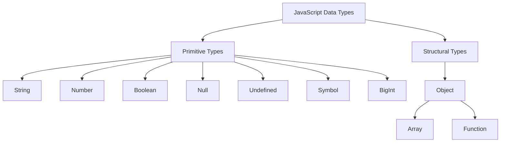

# Section 1: JavaScript Fundamentals (The Bedrock) 🧱

Idhi mana JavaScript building ki foundation. Deeni meedha manam pedda pedda applications build chestham. Ready aa? Let's go! 🚀

---

### 1. Introduction to JavaScript

*   **JS ante ఏంటి? (What is JS?)**: JavaScript (JS) anedhi oka programming language. Deenitho manam web pages ni interactive ga cheyochu. Ante, buttons click cheste em avvali, form submit cheste em jaragali, animations ela chupinchali... antha JS ye chuskuntundhi.

*   **History 📜**: 1995 lo Brendan Eich ane oka developer Netscape browser kosam కేవలం 10 రోజుల్లో create chesaru! Appudu deeni peru Mocha, tarvata LiveScript, finally JavaScript ga maarindhi. Java popular ga undadam valla aa peru pettaru, anthe kani JS ki Java ki em sambandham ledhu.

*   **What it's used for?**: Appatlo kevalam websites kosame, kani ippudu JS chala powerful aipoindhi:
    *   **Frontend**: React, Angular, Vue (websites ni beautiful ga cheyadaniki).
    *   **Backend**: Node.js (servers ni build cheyadaniki).
    *   **Mobile Apps**: React Native (Android, iOS apps kosam).
    *   **Desktop Apps**: Electron (Spotify, VS Code lanti apps).

💡 **Fun Fact**: VS Code, the editor we often use, is itself built using JavaScript with Electron!

---

### 2. Setting Up (JS ni ela run cheyali?)

1.  **Browser Console**: Idhi easiest way. Edhaina browser lo `F12` or `Right-click -> Inspect` kotti `Console` tab loki vellandi. Akkada direct ga JS code rayochu.
2.  **HTML `<script>` tag**: Oka HTML file create chesi, andulo `<script>` tag petti JS rayochu.
3.  **Node.js**: Mee computer lo Node.js install cheskunte, browser lekundane JS run cheyochu. Oka file (e.g., `app.js`) create chesi, terminal lo `node app.js` ani run cheyali.

---

### 3. Variables & Constants (`var`, `let`, `const`) 📦

*   **What are variables?**
    *   Variables ante data ni store cheskune "boxes" or "containers" anamata. 📥
    *   Manam ee box ki oka peru istham, and aa box lo data ni store chestam.
    *   Example: `let myAge = 25;` - Ikkada `myAge` anedhi box peru, `25` anedhi aa box lo unna data.

*   **The Three Keywords to Create Variables**:
    *   `var`: 👴 Idhi old style (before 2015). Deeniki konni confusing behaviors unnai, so modern JS lo idi vadatam chala takkuva. **Simple ga cheppalante, avoid using it.**
    *   ⭐ `let`: ✅ Idhi variable create cheyadaniki modern way. `let` tho create chesina variable value ni manam tarvata change cheyochu.
    *   ⭐ `const`: 🔒 "Constant" ante "fixed". `const` tho create chesina variable ki manam oka sari value assign chesaka, malli daaniki kotha value ni assign cheyalem. **Use this by default**, unless you know the variable's value needs to change.

*   **`let` vs `const` Example**:
    ```javascript
    let score = 100;
    score = 150; // This is allowed! ✅

    const yearOfBirth = 1995;
    // yearOfBirth = 1996; // This will throw an Error! ❌
    ```

*   ❌ **Common Mistake with `const`**:
    *   `const` tho oka object ni declare cheste, manam aa object lopala unna properties ni change cheyochu!
    *   `const` anedhi, aa variable eppudu ade object ni point cheyali ani matrame chepthundhi. Lopalina object mutable ye.
    *   `const user = { name: 'Raju' }; user.name = 'Ravi';` - Idi perfect ga pani chestundhi.

*   🧠 **Tricky Interview Question**:
    *   **Question**: "If an object is declared with `const`, can you change its properties? Why or why not?"
    *   **Answer Hint**: "Yes, you can. `const` prevents re-assignment of the variable itself, not the mutation of the value it points to. The variable `user` will always point to the same object in memory, but the properties inside that object can be changed."

---

### 4. Data Types

JS lo data ni different types ga categorize chestaru.



*   **Primitive Types** (Simple, fundamental data)
    *   📖 `String`: Text data. e.g., `'Hello'`, `"Mawa"`.
    *   🔢 `Number`: All numbers (integers and decimals). e.g., `25`, `3.14`.
    *   💡 `Boolean`: Represents `true` or `false`. (An on/off switch).
    *   텅 `null`: Represents the intentional absence of any value. Maname "ikkada emi ledhu" ani cheppadam.
    *   🤷 `undefined`: A variable that has been declared, but has not yet been assigned a value.
    *   ✨ `Symbol`: Represents a unique identifier.
    *   🐘 `BigInt`: For extremely large numbers.
*   **Structural Type** (Complex data structures)
    *   🏛️ `Object`: Key-value pairs tho data ni store chestham. e.g., `{ name: 'Jules', role: 'Engineer' }`. Arrays and Functions are also types of objects in JS!

💡 **Fun Fact**: `typeof null` result is `'object'`. Idi JS lo oka famous, long-standing bug. Fix cheste chala existing websites break avuthai, so alaane unchesaru!

🧠 **Tricky Interview Question**: "What is the difference between `null` and `undefined`?"
*   **Answer Hint**: Think of it this way: `undefined` is a box the system sees but doesn't know what's in it. `null` is a box that you, the developer, have explicitly and intentionally made empty.

---

### 5. Type Coercion 🪄

*   **What is it?**
    *   Idi JS lo oka magic anamata! JS automatic ga oka data type ni inkokati ga marchutundhi when you use operators.
    *   **Analogy**: It's like a helpful friend who tries to guess what you mean. Sometimes they are right (`"5" - 3 = 2`), but sometimes they get it wrong (`"5" + 3 = "53"`)!

*   **The Golden Rule to Avoid Bugs**:
    *   ❌ **Don't use `==` (Loose Equality)**. It performs type coercion, which can lead to unexpected results (`5 == '5'` is `true`).
    *   ✅ **Always use `===` (Strict Equality)**. It checks both the value AND the type, without any magic conversion (`5 === '5'` is `false`).

🧠 **Tricky Interview Question**: "What is the output of `[] + []` and `[] + {}`? Why?"
*   **Answer Hint**: Empty array becomes empty string. `'' + ''` is `''`. Empty object becomes `"[object Object]"`. `'' + '[object Object]'` is `'[object Object]'`.

---

### 6. Basic Operators

*   **Arithmetic**: `+` (add), `-` (subtract), `*` (multiply), `/` (divide), `%` (remainder), `**` (power).
*   **Assignment**: `=`, `+=` (e.g., `a += 5` is `a = a + 5`), `-=`.
*   **Comparison**: `==` (loose), `===` (strict), `!=` (loose not equal), `!==` (strict not equal), `>`, `<`, `>=`, `<=`.
*   **Logical**: `&&` (AND), `||` (OR), `!` (NOT). These use "short-circuiting". Ante, result telisipogane, migatha expression ni check cheyavu. E.g., `false && someFunction()` - `someFunction` will never run.

---

### 7. Strings

Strings ante aksharala samuharam (sequence of characters). Strings are **immutable**, ante oka sari create chesaka, original string ni change cheyalem. Prathi method oka *new* string ni return chestundhi.

*   **Template Literals**: `` ` `` (backticks) use chesi strings create cheyochu. Idi chala convenient.

#### String Methods (Categorized)

**Category 1: Searching & Finding**
*   ⭐ `includes(substring)`: Substring undha ledha ani check chestundhi (`true`/`false`).
*   ⭐ `indexOf(substring)`: Substring yokka first position ni isthundhi. Lekapothe `-1`.
*   `lastIndexOf(substring)`: Substring yokka last position ni isthundhi.
*   ⭐ `startsWith(substring)`: Aa substring tho start avuthundha? (`true`/`false`).
*   ⭐ `endsWith(substring)`: Aa substring tho end avuthundha? (`true`/`false`).

**Category 2: Extracting Parts**
*   ⭐ `slice(startIndex, endIndex)`: String lo oka piece ni cut chesi isthundhi. `endIndex` is not included.
*   `substring(startIndex, endIndex)`: `slice` laantide, kani negative indexes ni handle cheyadu.
*   `substr(startIndex, length)`: `startIndex` nunchi `length` characters isthundhi. (Legacy, avoid using).

**Category 3: Creating New Strings**
*   ⭐ `toUpperCase()`: Anni characters ni peddaga chestundhi.
*   ⭐ `toLowerCase()`: Anni characters ni chinnaga chestundhi.
*   ⭐ `replace(target, replacement)`: First `target` ni `replacement` tho replace chestundhi.
*   `replaceAll(target, replacement)`: Anni `target`s ni replace chestundhi.
*   ⭐ `trim()`: Start and end lo unna spaces ni remove chestundhi.
*   ⭐ `split(separator)`: String ni oka `separator` base cheskuni array ga vidagottutundhi.
*   `concat(string2, ...)`: Rendu strings ni kaluputhundhi. `+` operator is easier.

**Category 4: Accessing Characters**
*   `charAt(index)`: Aa position lo unna character ni isthundhi.
*   `at(index)`: `charAt` laantide, kani negative index kuda ivvochu (end nunchi count avuthundhi).

❌ **Common Mistake with Strings**: String methods original string ni change cheyavu ani marchipovadam.

🧠 **Tricky Interview Question**: "How do you reverse a string in JavaScript?"
*   **Answer Hint**: There's no built-in `reverse()` method for strings. You have to be clever: `myString.split('').reverse().join('')`. String ni array ga marchi, reverse chesi, malli string ga kalupali.
