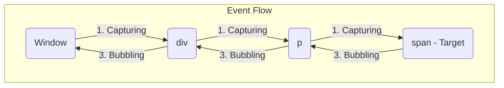

# Section 3.1: DOM Events (Making Pages Interactive) ⚡

Mawa, manam elements ni select cheyadam, marchadam nerchukunnam. Ippudu asalu magic start avuthundhi. User chese panulaki (clicks, typing, etc.) mana page ela respond avvalo cheppedhe "Events".

### What are Events?

Events anevi browser manaku pampinche signals. Ee signals "hey, something just happened!" ani chepthayi. For example:
*   User oka button ni click chesaru.
*   Mouse ni oka element meedha ki aadincharu.
*   Page antha load aipoindhi.
*   User oka form submit chesaru.

Mana JavaScript code ee signals ni "listen" chesi, response ga oka function ni run cheyochu.

---

### Handling Events with `addEventListener`

Idi event handling ki modern and standard approach.
`element.addEventListener('eventName', callbackFunction);`

*   `eventName`: Manam listen cheyalanukuntunna event peru (e.g., `'click'`, `'mouseover'`).
*   `callbackFunction`: Event jariginappudu run avvalsina function.

**Why is it better than old ways (like `element.onclick`)?**
*   Oka element ki, okate event ki, multiple listeners add cheyochu.
*   Event flow (bubbling/capturing) meedha manaku ekkuva control untundhi.

---

### The `event` Object

Event listener function run ayinapudu, browser automatic ga oka object ni create chesi, aa function ki argument ga pass chestundhi. Daanine `event` object antaru. Ee object lo aa event gurinchi chala useful information untundhi.

**Most Important Properties & Methods:**

*   ⭐ `event.target`: Event *start* ayina actual element. For example, manam oka `div` ki click listener pedithe, kani aa `div` lopala unna `button` ni click cheste, `event.target` will be the `button`.
*   ⭐ `event.preventDefault()`: Browser yokka default action ni aapataniki. Idi chala important!
    *   **Example 1**: `<form>` submit cheste page reload avuthundhi. Danni aapaniki `event.preventDefault()` vadatharu.
    *   **Example 2**: `<a>` tag ni click cheste new page ki velthundhi. Danni aapaniki kuda ide vadatharu.
*   ⭐ `event.stopPropagation()`: Event "bubbling" ni aapataniki. Deeni gurinchi kindha detail ga chuddam.

---

### Deep Dive: Event Bubbling & Capturing 🧠

Idi DOM events lo oka fundamental concept. Chala interview-worthy topic!

Oka element meedha event jariginappudu, adi 3 phases lo travel chestundhi:

1.  **Capturing Phase**: Event `window` nunchi start ayi, DOM tree lo diguthu, target element varaku vasthundhi.
2.  **Target Phase**: Event actual target element ni reach avuthundhi.
3.  **Bubbling Phase**: Event target nunchi start ayi, malli DOM tree lo paiki velthu, `window` varaku velthundhi.

**By default, all event listeners work in the BUBBLING PHASE.**

**Visualization:**
Imagine this HTML: `div > p > span`. If you click the `span`:

**What does this mean?**
Ante, manam `span` ni click cheste, `span` yokka click event trigger avuthundhi. Adi aipogane, daani parent (`p`) yokka click event trigger avuthundhi. Tarvata `div` di, tarvata `body` di... ala `window` varaku velthundhi. Idhi "bubbling up" anamata.

**Why is this useful?**
Deeni valla manam "Event Delegation" ane powerful pattern ni implement cheyochu. Ante, chala child elements ki individual ga listeners pettadam badulu, vaati parent ki okate listener petti, `event.target` tho ഏ child click ayindho kanukovachu. This is very efficient.

**How to stop it?**
Okaవేళ manaku event bubble avvadam ishtam lekapothe, `event.stopPropagation()` use cheyochu. Idi event ni aa element thone aapesthundhi, paiki vellanivvadu.

---

### Common Events List

| Category | Event Names |
| :--- | :--- |
| **Mouse** | `click`, `dblclick`, `mouseover`, `mouseout`, `mousemove`, `mousedown`, `mouseup` |
| **Keyboard**| `keydown` (key pressed), `keyup` (key released) |
| **Form** | `submit` (on the `<form>` element), `change` (on `input`, `select`), `input`, `focus`, `blur` |
| **Window** | `load` (page and all resources finished loading), `DOMContentLoaded` (only HTML loaded), `resize`, `scroll` |

Next, let's see all of this in action in `03-dom-events.html` and `.js`!
