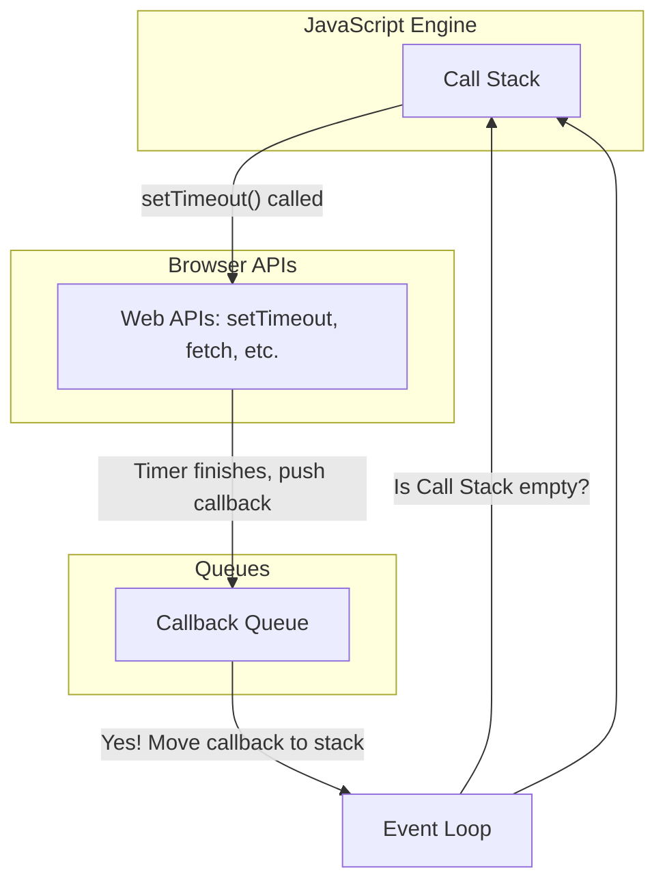

# Section 4.1: Asynchronous JS: The Event Loop & Callbacks ⏳

Mawa, welcome to one of the most important and powerful topics in all of JavaScript. Ikkada manam nerchukuntam, mana code at a time okate pani kakunda, multiple panulani ela handle chestundho.

### Synchronous vs. Asynchronous

*   **Synchronous (Sync)**: By default, JavaScript is synchronous. Ante, adi code ni line-by-line, okati tarvata okati execute chestundhi. Oka line complete ayye varaku, next line wait cheyalsindhe.
    *   **Analogy**: A single-lane road. Only one car can pass at a time. If one car stops, all the cars behind it are blocked.

*   **Asynchronous (Async)**: Asynchronous ante, oka pani start chesi, adi complete avvadaniki wait cheyakunda, next line ki vellipovadam. Aa pani complete ayyaka, manaku a notification vasthundhi.
    *   **Analogy**: Ordering food at a restaurant. Meeru order chesi, token theeskuni, velli table lo kurchuntaru. Mee food ready ayyaka, token light veluguthundhi. Ee madhyalo meeru free ga ne unnaru.

**Why is Async so important?**
*   🌐 Web pages lo chala panulu time theeskuntai (e.g., server nunchi data thevadam, oka pedda image ni load cheyadam).
*   🥶 Ee panulu sync ga jarigithe, antha sepu mee website **freeze** aipothundhi! User em click cheyaleka, scroll cheyaleka chala frustrate avutharu.
*   😎 Async valla, ee long-running tasks background lo jaruguthu untai, and website responsive ga untundhi.

---

### The Event Loop (The "How it Works" Deep Dive) 🧠

*   "JavaScript is a single-threaded language" ani meeru vinundochu. Mari ala aithe, adi async panulani ela handle chestundhi?
*   The answer is the **Event Loop**, which is part of the browser's environment, not the JS engine itself.

Here are the key components:
*   🥞 **Call Stack**: Idi JS functions execute ayye place. (Last-In, First-Out).
*   🌐 **Web APIs**: Evi browser manaku icche extra powers (`setTimeout`, DOM events, `fetch`). Async operation start ayinapudu, adi Web API ki handoff cheyabaduthundhi.
*   🚶‍♂️ **Callback Queue (or Task Queue)**: Web API lo task complete ayyaka, daani callback function ee queue lo vachi paduthundhi. (First-In, First-Out).
*   🕵️ **Event Loop**: Deeniki okate pani: **"Is the Call Stack empty?"** ani continuously check cheyadam. Call Stack empty ga unte, adi Callback Queue lo unna first item ni theesi Call Stack lo peduthundhi, so it can be executed.

**Visualization of the Flow:**


---

### Callbacks: The Original Way

Callback anedhi oka function, daanini manam inko function ki argument ga pass chestam. Aa function thana pani poorthi ayyaka, ee callback function ni call chestundhi. This was the original pattern for async operations in JS.

```javascript
console.log("Ordering pizza...");

// setTimeout is an async function provided by the browser (Web API)
setTimeout(() => {
    // This function is the "callback"
    console.log("Pizza is ready! 🍕");
}, 2000); // Wait for 2000ms

console.log("Doing something else while waiting for pizza...");
```

### Callback Hell (The "Pyramid of Doom")

Callbacks simple cases lo bagane unna, multiple dependent async operations unnapudu situation darunamga untundhi. Okati tarvata okati jaragali ante, callbacks ni okati lopala okati nest cheyalsi vasthundhi.

Idi chudataniki oka pyramid la kanipisthundhi, anduke deenini **"Pyramid of Doom"** or **"Callback Hell"** antaru.

**Example:**
```javascript
// Imagine these are real database calls
setTimeout(() => {
    console.log("Getting user data...");
    setTimeout(() => {
        console.log("Getting user's posts...");
        setTimeout(() => {
            console.log("Getting post's comments...");
            // And so on... this gets very messy!
        }, 1000);
    }, 1000);
}, 1000);
```
**Problems with Callback Hell:**
1.  **Hard to Read**: Code chala confusing ga untundhi.
2.  **Hard to Maintain**: Chinna change cheyalanna, chala kashtam.
3.  **Error Handling is a Nightmare**: Prathi level lo error ni handle cheyadam chala complex.

Ee problem ni solve cheyadanike **Promises** vachai. Let's see them in the next section!
